## reference
引用存放的是变量的地址
1. 创建必须初始化
2. 不能NULL
3. 不能改变引用关系

## http 1.0/1.1
1. HTTP1.0短连接，每次请求都需要建立TCP连接
2. HTTP1.1长连接，被多个请求复用
3. 在同一个TCP连接里，所有的数据通信按次序进行，服务器处理完一个请求，接着处理下一个  
4. HTTP2.0 IO multiplexing

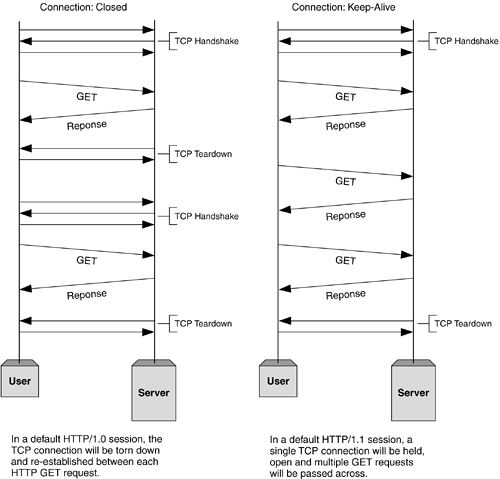

## shared_ptr
**use** `shared_ptr<T> p=make_shared(new T)`  

std::shared_ptr is a smart pointer that retains shared ownership of an object through a pointer. Several shared_ptr objects may own the same object. The object is destroyed and its memory deallocated when either of the following happens:
- the last remaining shared_ptr owning the object is destroyed;
- the last remaining shared_ptr owning the object is assigned another pointer via operator= or reset().

## polymorphism
define polymorphism as the ability of a message to be displayed in more than one form.

~~~cpp
Derived d;
Base b=d;
b.fun();
//call Base::fun
Base* p = new Derived();
p->fun();
delete p;
//call Derived::fun
~~~

## randa()->randb()
- a>b
~~~cpp
int randB()
{
    int x=~(1<<31);
    while(x>b*(A/b))
        x=RandA();
    return x%b+1;
}
~~~
- a<b
randA2()=a*(randA()-1)+randA(),till Ak>b case 1

## c++ class/struct
struct:a public class
### memlayout
- 成员函数：代码区
- 静态变量：全局数据区
- 非静态变量在实例内：栈区或堆区
- 虚函数指针在实例内

非虚成员函数是唯一的，在编译时为成员函数进行处理，参数加上this指针，与普通函数一样  
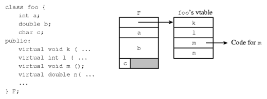

## extern "C"
按c的风格编译，不支持函数重载等。  
以此实现实现c和c++的混合编程
- c++ call c:c++ extern "C" {include}
- c call c++: c++ uses extern "C" declaration 

## foreign key
They allow us to place related data into multiple tables and then link them together to keep their integrity
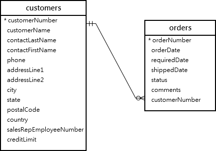

## push and emplace
- `push_back`:construct,copy
- `emplace_back`:directly construct

## avoid deadlock
- lock the resource in same order
- `try_lock()`
- banker's theory

## TCP congestion control
1. slow start:cwnd incremtns exponentially while cwnd is less than ssthresh `cwnd*=2`
2. Cngestion avoidance:after each RTT `cwnd++`
### Congestion Detection:
- Timeout:`ssthresh=cwnd/2,cwnd=1`,start with slow start again
- 3 ack duplicates:`ssthresh=cwnd/2,cwnd=ssthresh`,start with congestion avoidance  (i.e. Fast retransmit and fast recovery)
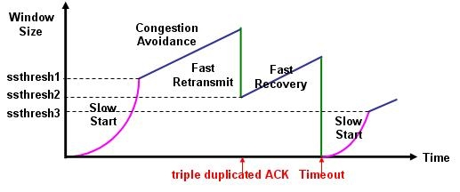

## layered network architecture
 A Layered architecture provides a clean-cut interface so that minimum information is shared among different layers. It also ensures that the implementation of one layer can be easily replaced by another implementation.
 - 封装对下层的变化，每一层专注完成一份任务
 - 功能互相解耦：物理层只关心比特位传输，数据链路层只关心数据帧送达对应MAC主机，不管什么传输方式  
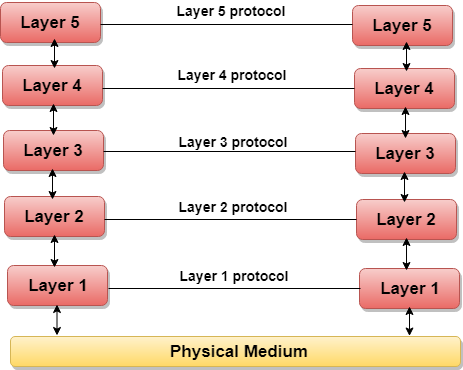

## RUDP
aims to provide a solution where UDP is too primitive because guaranteed-order packet delivery is desirable, but TCP adds too much complexity/overhead.

### implementations
- Acknowledgment of received packets
- Windowing and flow control
- Retransmission of lost packets
- Over buffering
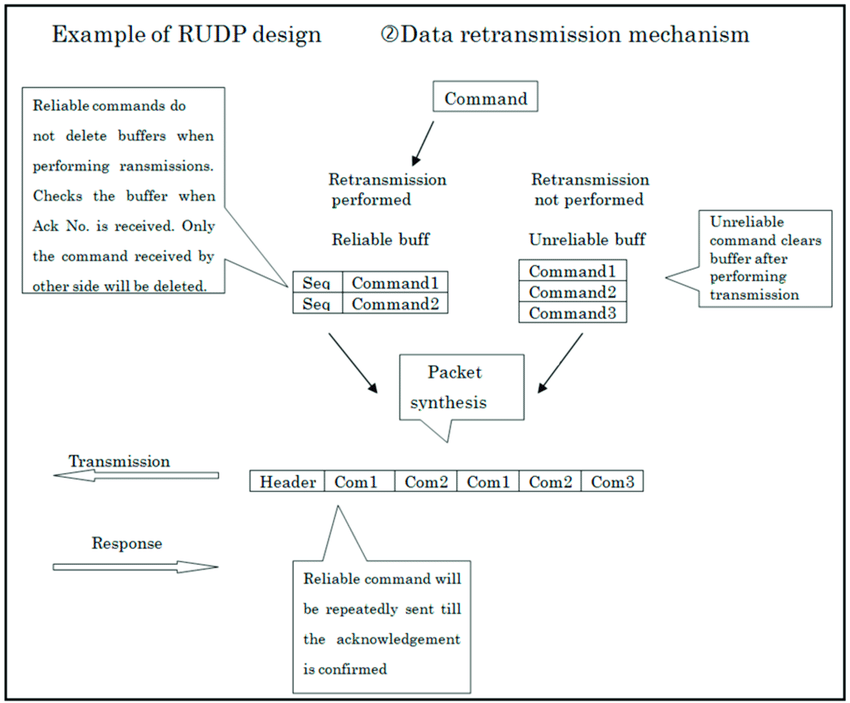

## subnetting
A subnetwork or subnet is a logical subdivision of an IP network. The practice of dividing a network into two or more networks is called subnetting.  

For IPv4, a network may also be characterized by its subnet mask or netmask, which is the bitmask that, when applied by a bitwise AND operation to any IP address in the network, yields the routing prefix. Subnet masks are also expressed in dot-decimal notation like an IP address. For example, the prefix 198.51.100.0/24 would have the subnet mask 255.255.255.0.  

## MSS MTU
To avoid fragmentation in the IP layer, a host must specify the maximum segment size as equal to the largest IP datagram that the host can handle minus the IP and TCP header sizes. Therefore, IPv4 hosts are required to be able to handle an MSS of 536 octets (= 576 - 20 - 20) and IPv6 hosts are required to be able to handle an MSS of 1220 octets (= 1280 confirmed when second handshake  
- UDP,ICMP: when > MTU, network layer packet beconmes fragmented  
- TCP: when > MSS, transport layer segment becomes fragmented
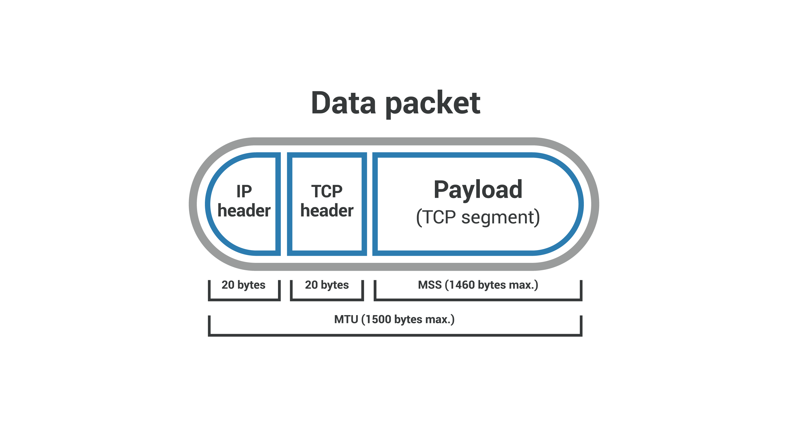

## interrupt
In digital computers, an interrupt is a response by the processor to an event that needs attention from the software. An interrupt condition alerts the processor and serves as a request for the processor to interrupt the currently executing code when permitted, so that the event can be processed in a timely manner.  
- 保存当前状态，停止执行当前任务
- 转而执行中断处理程序，处理IO,处理完毕后继续执行原程序流  
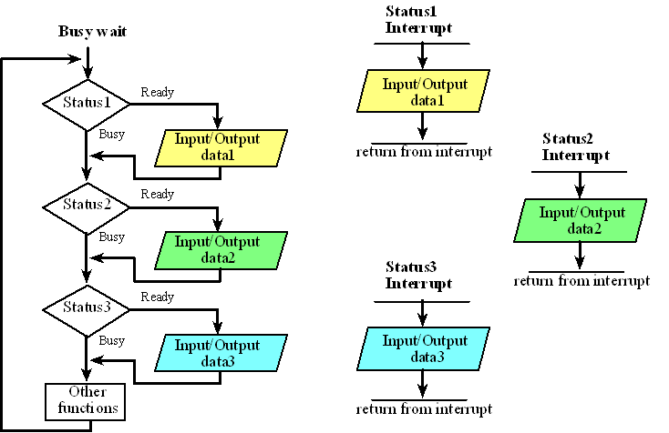

### software interrupt vs hardware interrupt
- Hardware interrupts were introduced as a way to avoid wasting the processor’s valuable time in polling loops, waiting for external events. **e.g. time interrupt**  
-  It occurs when an application program terminates or requests certain services from the operating system. **e.g. system calls**  

## page fault
In computing, a page fault (sometimes called PF or hard fault) is an exception that the memory management unit (MMU) raises when a process accesses a memory page without proper preparations. Accessing the page requires a mapping to be added to the process's virtual address space. Besides, the actual page contents may need to be loaded from a backing store, such as a disk. The MMU detects the page fault, but the operating system's kernel handles the exception by making the required page accessible in the physical memory or denying an illegal memory access.  
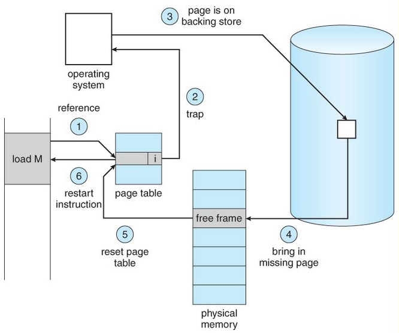

## virtual memory
In computing, virtual memory, or virtual storage is a memory management technique that provides an "idealized abstraction of the storage resources that are actually available on a given machine" which "creates the illusion to users of a very large (main) memory".  

## memory_order
std::memory_order specifies how memory accesses, including regular, non-atomic memory accesses, are to be ordered around an atomic operation. 
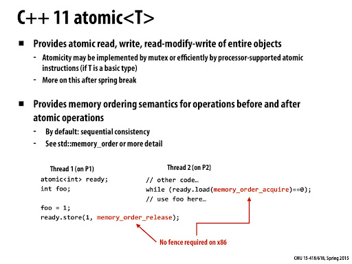
- **memory_order_relaxed**:Relaxed operation: there are no synchronization or ordering constraints imposed on other reads or writes, only this operation's atomicity is guaranteed  
- **memory_order_consume**:A load operation with this memory order performs a consume operation on the affected memory location: no reads or writes in the current thread dependent on the value currently loaded can be reordered before this load.  
- **memory_order_acquire**:A load operation with this memory order performs the acquire operation on the affected memory location: no reads or writes in the current thread can be reordered before this load.  
- **memory_order_release**:A store operation with this memory order performs the release operation: no reads or writes in the current thread can be reordered after this store.  
- **memory_order_acq_rel**:A read-modify-write operation with this memory order is both an acquire operation and a release operation. No memory reads or writes in the current thread can be reordered before or after this store.  
- **memory_order_seq_cst**:A load operation with this memory order performs an acquire operation, a store performs a release operation  

## Signal (IPC)
Signals are standardized messages sent to a running program to trigger specific behavior, such as quitting or error handling. They are a limited form of inter-process communication (IPC), typically used in Unix, Unix-like, and other POSIX-compliant operating systems.  
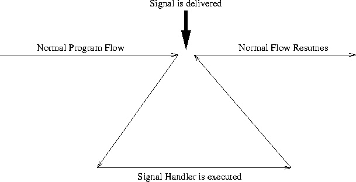

- `SIGINT`:interrupt by ctrl-c
- `SIGTERM`:default signal by kill
- `KILL()`:send a signal to a process or a group of processes  

